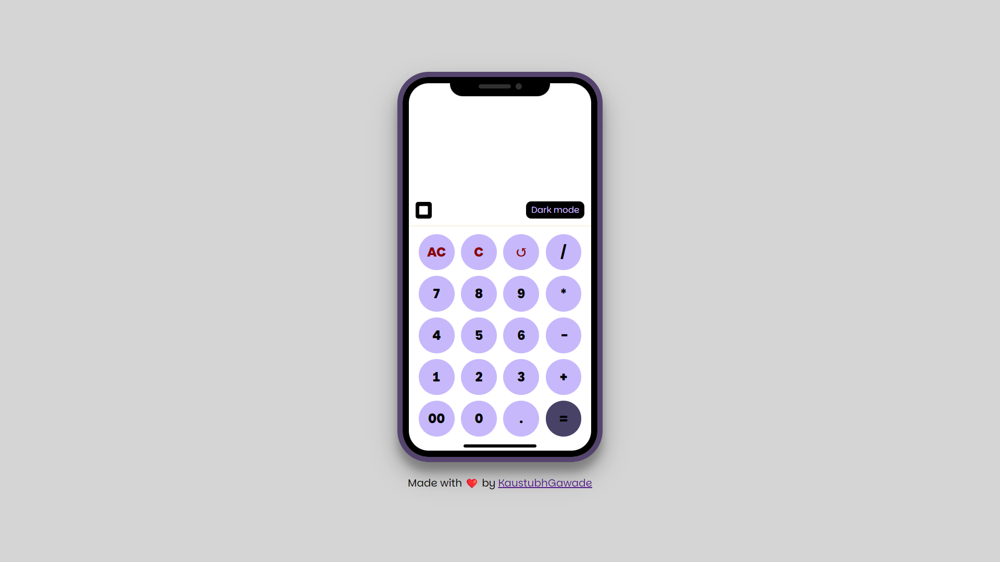
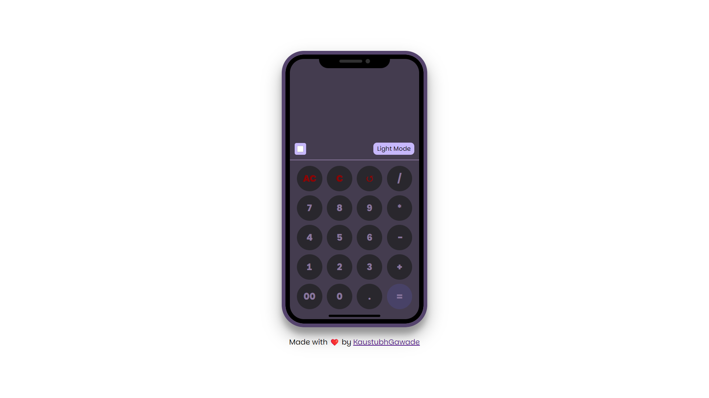

# **🧮 Responsive Calculator**

A sleek, responsive calculator application built with **HTML**, **CSS**, and **JavaScript**. This tool is perfect for quick and accurate arithmetic operations with added features like dark mode, keyboard support, and more!  

---

## **✨ Features**

### Core Features  
- 🧮 Perform basic arithmetic operations: **Addition**, **Subtraction**, **Multiplication**, **Division**.  
- 🗑️ Clear (`AC`) and backspace (`C`) functionality.  
- ⌨️ **Keyboard support** for easy input.  
- 🌙 **Dark mode** toggle for an eye-friendly experience.  
- 🖥️ **Fullscreen mode** for distraction-free calculations.  

### Advanced Features  
- 📜 **History Tracking**: View your last calculation.  
- 📱 Fully **Responsive Design**: Works smoothly on all devices.  
- Optional future features:  
  - 🧠 Memory functions (store and recall values).  
  - 🧪 Support for scientific calculations like square root, power, and percentages.

---

## **🛠️ Tech Stack**

- **HTML5**: Semantic structure of the app.  
- **CSS3**: Styling and responsive design.  
- **Vanilla JavaScript**: Core functionality and interactivity.

---

## **🚀 Getting Started**

1. **Clone the Repository**  
   ```bash
   git clone https://github.com/username/repository-name.git
   ```
2. **Navigate to the Project Directory**  
   ```bash
   cd repository-name
   ```
3. **Run the Application**  
   - Open the `index.html` file in your browser.

---

## **💡 How to Use**

### Buttons  
| **Button** | **Functionality**                          |
|------------|--------------------------------------------|
| `AC`       | Clears all input.                         |
| `C`        | Deletes the last input.                   |
| `+`, `-`, `*`, `/` | Perform arithmetic operations.    |
| `=`        | Calculates and displays the result.       |
| `.`        | Adds a decimal point to the input.         |
| `↺`        | Displays the last calculation (History).   |

### Keyboard Shortcuts  
| **Key**     | **Action**                                |
|-------------|------------------------------------------|
| Numbers 0-9 | Enter digits.                            |
| `+`, `-`, `*`, `/` | Perform arithmetic operations.    |
| `Backspace` | Deletes the last input.                  |
| `Enter` or `=` | Calculates the result.                |
| `F`         | Toggles fullscreen mode.                 |

---

## **📘 Syntax Examples**

### Basic Calculation  
1. Enter numbers and operations using the keypad or keyboard.  
   ```text
   Input: 5 + 3  
   Output: 8  
   ```
2. Use `AC` to clear all inputs or `C` to delete the last digit.

### History  
Click on `↺` to see the last calculation performed.  
```text
Input: 10 * 2  
History: 10 * 2 = 20  
```

### Dark Mode  
Click the **Dark Mode** button to toggle the theme.  
```text
Default: Light Mode  
Toggled: Dark Mode  
```

### Fullscreen  
Press `F` or click the fullscreen button to expand the calculator.

---

## **🎨 Customization - Future Work**

1. **Add Scientific Features**  
   - Implement buttons for advanced operations like `√`, `^`, `%`.  
   - Update the JavaScript to handle these functionalities.

2. **Persist History**  
   - Use `localStorage` to store and retrieve history even after closing the browser.

3. **Multi-language Support**  
   - Add options to toggle between languages for global accessibility.

---

## **🖼️ Screenshots**

### Light Mode  
  

### Dark Mode  
  

---

## **👨‍💻 Author**

**Kaustubh Gawade**  
- [GitHub](https://github.com/kaustubhgawade)  
- [Portfolio](https://kaustubhgawade.github.io/)  

---

## **🤝 Contributing**

Contributions are welcome! Here's how you can contribute:  

1. Fork the repository.  
2. Create a new branch for your feature:  
   ```bash
   git checkout -b feature-name
   ```
3. Commit your changes:  
   ```bash
   git commit -m "Add new feature"
   ```
4. Push to the branch:  
   ```bash
   git push origin feature-name
   ```
5. Open a pull request.

Let’s build something amazing together! 🚀
